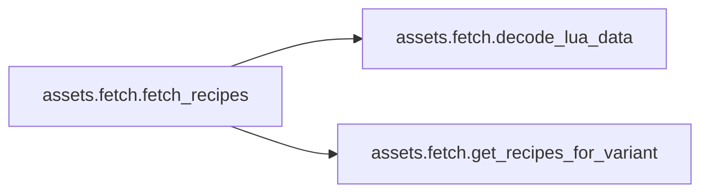

# Assets Fetch

[_Documentation generated by Documatic_](https://www.documatic.com)

<!---Documatic-section-Codebase Structure-start--->
## Codebase Structure

<!---Documatic-block-system_architecture-start--->
```mermaid
None
```
<!---Documatic-block-system_architecture-end--->

# #
<!---Documatic-section-Codebase Structure-end--->

<!---Documatic-section-assets.fetch.fetch_tilemaps-start--->
## [assets.fetch.fetch_tilemaps](3-assets_fetch.md#assets.fetch.fetch_tilemaps)

<!---Documatic-section-fetch_tilemaps-start--->
<!---Documatic-block-assets.fetch.fetch_tilemaps-start--->
<details>
	<summary><code>assets.fetch.fetch_tilemaps</code> code snippet</summary>

```python
def fetch_tilemaps(base_directory: str):
    graphics_directory = path.join(base_directory, 'graphics', 'entity')
    files = [('assembling-machine-1', 'hr-assembling-machine-1.png'), ('assembling-machine-1', 'hr-assembling-machine-1-shadow.png'), ('burner-inserter', 'hr-burner-inserter-hand-base-shadow.png'), ('burner-inserter', 'hr-burner-inserter-hand-closed-shadow.png'), ('burner-inserter', 'hr-burner-inserter-hand-open-shadow.png'), ('inserter', 'hr-inserter-hand-base.png'), ('inserter', 'hr-inserter-hand-closed.png'), ('inserter', 'hr-inserter-hand-open.png'), ('inserter', 'hr-inserter-platform.png'), ('long-handed-inserter', 'hr-long-handed-inserter-hand-base.png'), ('long-handed-inserter', 'hr-long-handed-inserter-hand-closed.png'), ('long-handed-inserter', 'hr-long-handed-inserter-hand-open.png'), ('long-handed-inserter', 'hr-long-handed-inserter-platform.png'), ('splitter', 'hr-splitter-east-top_patch.png'), ('splitter', 'hr-splitter-east.png'), ('splitter', 'hr-splitter-north.png'), ('splitter', 'hr-splitter-south.png'), ('splitter', 'hr-splitter-west-top_patch.png'), ('splitter', 'hr-splitter-west.png'), ('transport-belt', 'hr-transport-belt.png'), ('underground-belt', 'hr-underground-belt-structure.png')]
    for file in files:
        source = path.join(graphics_directory, *file)
        destination = path.join(path.dirname(__file__), file[-1])
        print('Copying: {} -> {}'.format(source, destination))
        shutil.copyfile(source, destination)
```
</details>
<!---Documatic-block-assets.fetch.fetch_tilemaps-end--->
<!---Documatic-section-fetch_tilemaps-end--->

# #
<!---Documatic-section-assets.fetch.fetch_tilemaps-end--->

<!---Documatic-section-assets.fetch.decode_lua_data-start--->
## [assets.fetch.decode_lua_data](3-assets_fetch.md#assets.fetch.decode_lua_data)

<!---Documatic-section-decode_lua_data-start--->
<!---Documatic-block-assets.fetch.decode_lua_data-start--->
<details>
	<summary><code>assets.fetch.decode_lua_data</code> code snippet</summary>

```python
def decode_lua_data(text):
    tree = ast.parse(text)
    (invoke,) = tree.body.body
    assert invoke.source.id == 'data' and invoke.func.id == 'extend'
    (table,) = invoke.args
    assert isinstance(table, ast.Table)

    def recurse(node):
        if isinstance(node, ast.Table):
            result = {}
            for field in node.fields:
                if isinstance(field.key, ast.Number):
                    key = field.key.n
                elif isinstance(field.key, ast.Name):
                    key = field.key.id
                else:
                    assert False
                result[key] = recurse(field.value)
            try:
                return [result[i + 1] for i in range(len(result))]
            except KeyError:
                return result
        elif isinstance(node, ast.String):
            return node.s
        elif isinstance(node, ast.FalseExpr):
            return False
        elif isinstance(node, ast.TrueExpr):
            return True
        elif isinstance(node, ast.Number):
            return node.n
        else:
            assert False
    return recurse(table)
```
</details>
<!---Documatic-block-assets.fetch.decode_lua_data-end--->
<!---Documatic-section-decode_lua_data-end--->

# #
<!---Documatic-section-assets.fetch.decode_lua_data-end--->

<!---Documatic-section-assets.fetch.get_recipes_for_variant-start--->
## [assets.fetch.get_recipes_for_variant](3-assets_fetch.md#assets.fetch.get_recipes_for_variant)

<!---Documatic-section-get_recipes_for_variant-start--->
<!---Documatic-block-assets.fetch.get_recipes_for_variant-start--->
<details>
	<summary><code>assets.fetch.get_recipes_for_variant</code> code snippet</summary>

```python
def get_recipes_for_variant(data, variant):
    recipes = []
    for entry in data:
        if 'category' in entry and entry['category'] not in ('crafting', 'advanced-crafting'):
            continue
        time = entry.get('energy_required', 0.5)
        if variant in entry:
            entry = entry[variant]
        time = entry.get('energy_required', time)
        if 'ingredients' not in entry and ('result' not in entry or 'results' not in entry):
            entry = entry['normal']
        ingredients = []
        for item in entry['ingredients']:
            if isinstance(item, list):
                ingredients.append({'name': item[0], 'amount': item[1]})
            else:
                assert item['type'] == 'item'
                ingredients.append({'name': item['name'], 'amount': item['amount']})
        if 'results' in entry:
            results = []
            for item in entry['results']:
                assert item['type'] == 'item'
                results.append({'name': item['name'], 'amount': item['amount']})
        else:
            results = [{'name': entry['result'], 'amount': entry.get('result_count', 1)}]
        recipes.append({'time': time, 'ingredients': ingredients, 'results': results})
    return recipes
```
</details>
<!---Documatic-block-assets.fetch.get_recipes_for_variant-end--->
<!---Documatic-section-get_recipes_for_variant-end--->

# #
<!---Documatic-section-assets.fetch.get_recipes_for_variant-end--->

<!---Documatic-section-assets.fetch.fetch_recipes-start--->
## [assets.fetch.fetch_recipes](3-assets_fetch.md#assets.fetch.fetch_recipes)

<!---Documatic-section-fetch_recipes-start--->


### Object Calls

* [assets.fetch.decode_lua_data](3-assets_fetch.md#assets.fetch.decode_lua_data)
* [assets.fetch.get_recipes_for_variant](3-assets_fetch.md#assets.fetch.get_recipes_for_variant)

<!---Documatic-block-assets.fetch.fetch_recipes-start--->
<details>
	<summary><code>assets.fetch.fetch_recipes</code> code snippet</summary>

```python
def fetch_recipes(base_directory):
    data = []
    for file in glob.glob(path.join(base_directory, 'prototypes', 'recipe', '*.lua')):
        with open(file) as f:
            text = f.read()
        entry = decode_lua_data(text)
        assert isinstance(entry, list)
        data += entry
    json.dump(data, open('temp.json', 'w'))
    for variant in ('normal', 'expensive'):
        with open(path.join(path.dirname(__file__), f'{variant}-recipes.json'), 'w') as f:
            json.dump(get_recipes_for_variant(data, variant), f)
```
</details>
<!---Documatic-block-assets.fetch.fetch_recipes-end--->
<!---Documatic-section-fetch_recipes-end--->

# #
<!---Documatic-section-assets.fetch.fetch_recipes-end--->

[_Documentation generated by Documatic_](https://www.documatic.com)